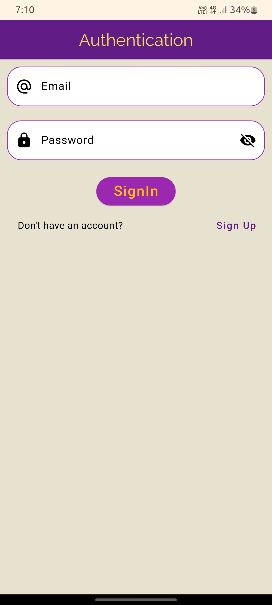
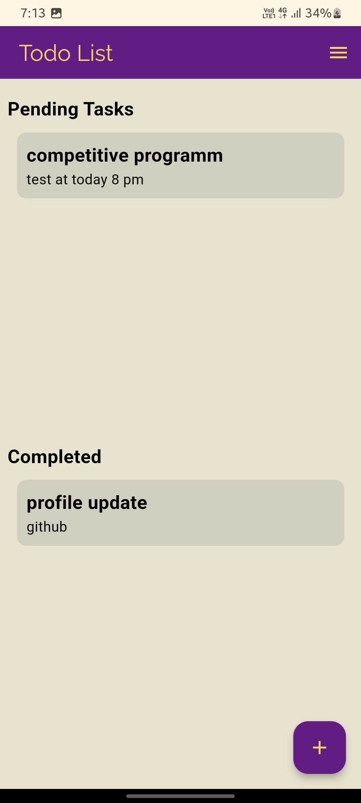
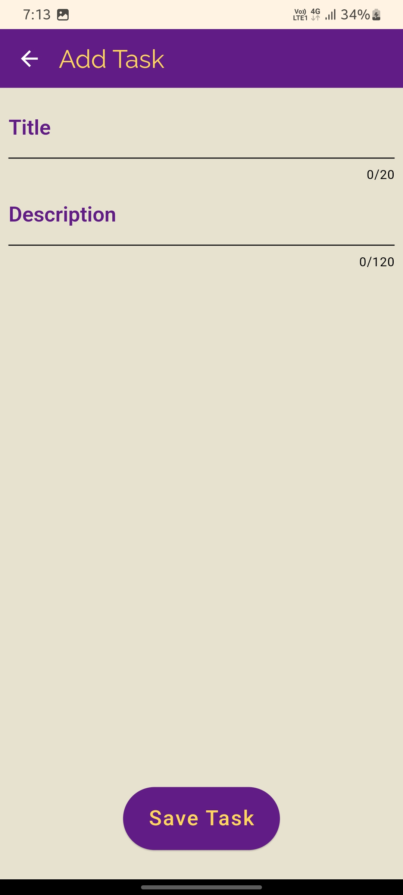
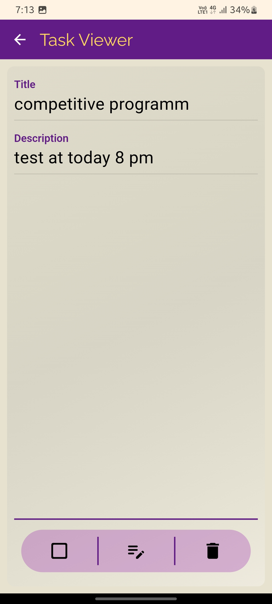

# Todo App

This is a simple Todo application built with Flutter and Firebase. This project was created as a beginner's project to learn and understand the basics of Flutter and Firebase.

## Features

- User Authentication
- Add, Edit, and Delete Tasks
- Mark tasks as completed or not completed
- Dark and Light theme support

## Technologies Used

- Flutter
- Dart
- Firebase
- Kotlin
- Java
- Gradle

### Screenshots
    

